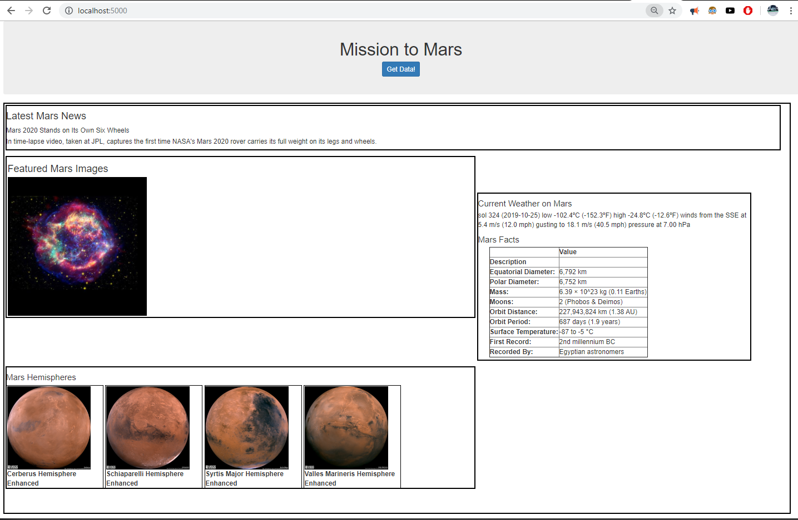

# Web Scraping Homework - Mission to Mars

Build a web application that scrapes various websites for data related to the Mission to Mars and displays the information in a single HTML page. 

Scraping

Used Jupyter Notebook, BeautifulSoup, Pandas, and Requests/Splinter for web scraping and analysis tasks.
- File: mission_to_mars.ipynb 

NASA Mars News
- Scraped the [NASA Mars News Site](https://mars.nasa.gov/news/) and collect the latest News Title and Paragraph Text.

JPL Mars Space Images - Featured Image

- Used splinter to navigate the site and find the image url for the current Featured Mars Image

Mars Weather

- Navigated to the Mars Weather twitter account [here](https://twitter.com/marswxreport?lang=en) and scraped the latest Mars weather tweet from the page.

Mars Facts

- Navigated to the Mars Facts webpage [here](https://space-facts.com/mars/) and use Pandas to scrape the table containing facts about the planet including Diameter, Mass, etc.

* Use Pandas to convert the data to a HTML table string.

Mars Hemispheres

- Obtained high resolution images for each of Mar's hemispheres from the USGS Astrogeology site [here](https://astrogeology.usgs.gov/search/results?q=hemisphere+enhanced&k1=target&v1=Mars) 

MongoDB and Flask Application

Used MongoDB with Flask templating to create a new HTML page that displays all of the information that was scraped from the URLs above.

- Created flask route called `/scrape` and imported scrape_mars.py to call the scrape function.

- Created a root route `/` that queries Mongo database and pass the mars data into an HTML template to display the data.

* Created a template HTML file called `index.html` that will take the mars data dictionary and display all of the data in the appropriate HTML elements.

